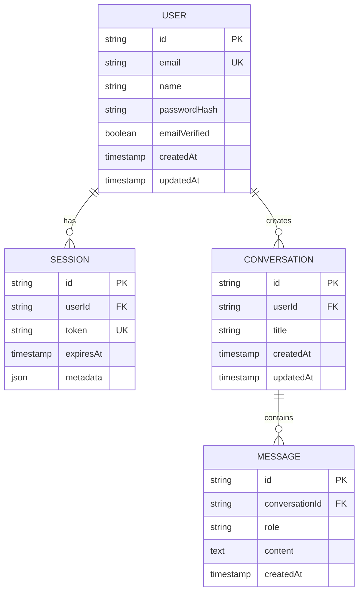

# QueryMate 🤖

A modern, powerful AI chat application that lets you interact with multiple AI providers in one place. Built with Next.js 15, featuring real-time streaming responses, secure authentication, and a beautiful UI.

## ✨ Key Features

### 🎯 Multi-AI Provider Support
- **Google Gemini**: Fast and intelligent responses
- **Perplexity AI**: Real-time web search and citations
- **Amazon Bedrock**: Enterprise-grade Claude models
- Switch between AI models seamlessly within conversations

### 💬 Advanced Chat Features
- Real-time streaming responses with elegant typing indicators
- Markdown support for rich text formatting (code blocks, lists, headings)
- Conversation history with persistent storage
- Auto-generated conversation titles using AI
- Message history with timestamps

### 🔐 Secure Authentication
- Email/Password authentication
- OAuth support (Google & GitHub)
- JWT token-based session management
- Protected API routes with Bearer authentication

### 🎨 Modern UI/UX
- Beautiful gradient designs with smooth animations
- Responsive layout for desktop and mobile
- Sidebar for conversation management
- Scroll-to-bottom on new messages
- Loading states and error handling

### 📱 Conversation Management
- Create unlimited conversations
- Update conversation titles
- Delete conversations with cascade message deletion
- Load chat history instantly
- Sidebar navigation between chats

## 🚀 Tech Stack

- **Framework**: Next.js 15 (App Router)
- **Language**: TypeScript
- **Database**: PostgreSQL (Supabase)
- **ORM**: Drizzle ORM
- **Authentication**: Better Auth
- **AI Providers**: 
  - Google Gemini (via @ai-sdk/google)
  - Perplexity AI (via @ai-sdk/perplexity)
  - Amazon Bedrock (via @ai-sdk/amazon-bedrock)
- **AI SDK**: Vercel AI SDK
- **UI Components**: Radix UI
- **Styling**: Tailwind CSS
- **Markdown**: react-markdown

## 🎯 What Makes QueryMate Special?

1. **Multiple AI Models in One Place**: Switch between Google Gemini, Perplexity, and Amazon Bedrock without leaving your conversation
2. **Real-time Streaming**: See AI responses as they're generated, not after completion
3. **Smart Context Management**: AI remembers your entire conversation history
4. **Beautiful UI**: Carefully crafted interface with smooth animations and gradients
5. **Fully Featured API**: Build your own frontend or integrate with existing apps
6. **Type-Safe**: Built with TypeScript for reliable, maintainable code

## 🛠️ Installation

### Prerequisites

- Node.js 20+ installed
- PostgreSQL database (Supabase account recommended)
- Google AI API key
- (Optional) GitHub & Google OAuth credentials

### Setup Steps

1. **Clone the repository**

```bash
git clone https://github.com/Jaswanth1406/QueryMate.git
cd QueryMate/querymate
```

2. **Install dependencies**

```bash
npm install
```

3. **Configure environment variables**

Create `.env.local` file in the project root:

```env
# --- SUPABASE ---
SUPABASE_DB_URL=xxxx
NEXT_PUBLIC_SUPABASE_URL=xxxx
SUPABASE_SERVICE_ROLE_KEY=xxxx

# --- BETTER AUTH ---
BETTER_AUTH_SECRET=xxxx

# --- GOOGLE OAUTH ---
GOOGLE_CLIENT_ID=xxxx
GOOGLE_CLIENT_SECRET=xxxx

# --- GITHUB OAUTH ---
GITHUB_CLIENT_ID=xxxx
GITHUB_CLIENT_SECRET=xxxx

# --- GOOGLE GEMINI ---
GOOGLE_API_KEY=your_google_gemini_api_key
GEMINI_MODEL=gemini-2.0-flash-exp

# --- PERPLEXITY AI ---
PERPLEXITY_API_KEY=your_perplexity_api_key
PERPLEXITY_MODEL=llama-3.1-sonar-large-128k-online

# --- AWS BEDROCK ---
AWS_ACCESS_KEY_ID=your_aws_access_key
AWS_SECRET_ACCESS_KEY=your_aws_secret_key
AWS_REGION=us-east-1
BEDROCK_MODEL_ID=anthropic.claude-3-5-sonnet-20240620-v1:0

```

4. **Push database schema**

```bash
npx drizzle-kit push
```

5. **Run development server**

```bash
npm run dev
```

Open [http://localhost:3000](http://localhost:3000) to view the app.

## 📚 API Documentation

### Authentication Endpoints

#### Sign Up

```http
POST /api/auth/sign-up/email
Content-Type: application/json

{
  "email": "user@example.com",
  "password": "securePassword123",
  "name": "John Doe"
}
```

**Response:**

```json
{
  "token": "eyJhbGciOiJIUzI1NiIsInR5cCI6IkpXVCJ9...",
  "user": {
    "id": "user_123",
    "email": "user@example.com",
    "name": "John Doe"
  }
}
```

#### Sign In

```http
POST /api/auth/sign-in/email
Content-Type: application/json

{
  "email": "user@example.com",
  "password": "securePassword123"
}
```

**Response:**

```json
{
  "token": "eyJhbGciOiJIUzI1NiIsInR5cCI6IkpXVCJ9...",
  "user": {
    "id": "user_123",
    "email": "user@example.com",
    "name": "John Doe"
  }
}
```

#### Get Current Session

```http
GET /api/auth/sessions
Authorization: Bearer YOUR_TOKEN_HERE
```

**Response:**

```json
{
  "user": {
    "id": "user_123",
    "email": "user@example.com",
    "name": "John Doe"
  },
  "session": {
    "id": "session_456",
    "expiresAt": "2025-12-25T00:00:00.000Z"
  }
}
```

#### Sign Out

```http
POST /api/auth/sign-out
Authorization: Bearer YOUR_TOKEN_HERE
Content-Type: application/json
```

**Response:**

```json
{
  "success": true
}
```

### Conversation Endpoints

#### Create New Conversation

```http
POST /api/conversations
Authorization: Bearer YOUR_TOKEN_HERE
Content-Type: application/json

{
  "title": "My Chat About AI"
}
```

**Response:**

```json
{
  "conversation": {
    "id": "conv_789",
    "userId": "user_123",
    "title": "My Chat About AI",
    "createdAt": "2025-11-25T10:00:00.000Z"
  }
}
```

#### Get All Conversations

```http
GET /api/conversations
Authorization: Bearer YOUR_TOKEN_HERE
```

**Response:**

```json
{
  "conversations": [
    {
      "id": "conv_789",
      "userId": "user_123",
      "title": "My Chat About AI",
      "createdAt": "2025-11-25T10:00:00.000Z",
      "updatedAt": "2025-11-25T10:00:00.000Z"
    }
  ]
}
```

#### Update Conversation Title

```http
PUT /api/conversations
Authorization: Bearer YOUR_TOKEN_HERE
Content-Type: application/json

{
  "id": "conv_789",
  "title": "Updated Title"
}
```

**Response:**

```json
{
  "conversation": {
    "id": "conv_789",
    "userId": "user_123",
    "title": "Updated Title",
    "createdAt": "2025-11-25T10:00:00.000Z",
    "updatedAt": "2025-11-25T10:30:00.000Z"
  }
}
```

#### Delete Conversation

```http
DELETE /api/conversations
Authorization: Bearer YOUR_TOKEN_HERE
Content-Type: application/json

{
  "id": "conv_789"
}
```

**Response:**

```json
{
  "message": "Conversation & messages deleted"
}
```

> **Note**: Deleting a conversation will also delete all associated messages. This action cannot be undone.

### Message Endpoints

#### Get Messages for a Conversation

```http
GET /api/messages?conversationId=conv_789
Authorization: Bearer YOUR_TOKEN_HERE
```

**Response:**

```json
{
  "messages": [
    {
      "id": "msg_001",
      "conversationId": "conv_789",
      "role": "user",
      "content": "Hello, what is AI?",
      "createdAt": "2025-11-25T10:00:00.000Z"
    },
    {
      "id": "msg_002",
      "conversationId": "conv_789",
      "role": "assistant",
      "content": "AI stands for Artificial Intelligence...",
      "createdAt": "2025-11-25T10:00:05.000Z"
    }
  ]
}
```

### Chat Endpoint

#### Send Message & Get AI Response

```http
POST /api/chat
Authorization: Bearer YOUR_TOKEN_HERE
Content-Type: application/json

{
  "message": "What is machine learning?",
  "conversationId": "conv_789",
  "model": "gemini",
  "title": "ML Discussion"
}
```

**Parameters:**

- `message` (required): The user's message text
- `model` (optional, default: "gemini"): AI model to use ("gemini", "perplexity", or "bedrock")
- `conversationId` (optional): ID of existing conversation. If omitted, creates new conversation
- `title` (optional): Title for new conversation (only used when conversationId not provided)

**Response:** Streaming text response from AI (Server-Sent Events)

**Example with different AI models:**

```javascript
// Use Google Gemini
fetch('/api/chat', {
  method: 'POST',
  headers: {
    'Authorization': 'Bearer YOUR_TOKEN',
    'Content-Type': 'application/json'
  },
  body: JSON.stringify({
    message: "Explain quantum computing",
    model: "gemini"
  })
});

// Use Perplexity (with real-time web search)
fetch('/api/chat', {
  method: 'POST',
  headers: {
    'Authorization': 'Bearer YOUR_TOKEN',
    'Content-Type': 'application/json'
  },
  body: JSON.stringify({
    message: "What's the latest news on AI?",
    model: "perplexity"
  })
});

// Use Amazon Bedrock (Claude)
fetch('/api/chat', {
  method: 'POST',
  headers: {
    'Authorization': 'Bearer YOUR_TOKEN',
    'Content-Type': 'application/json'
  },
  body: JSON.stringify({
    message: "Write a poem about technology",
    model: "bedrock"
  })
});
```

> **Note**: The `/api/chat` endpoint returns streaming responses. For testing in Postman, you'll see status 200 but the response body streams over time. Check the database `messages` table to verify AI responses are saved.

## 🔑 Key Concepts

### Multi-AI Architecture

QueryMate supports three AI providers, each with unique strengths:

1. **Google Gemini** (`gemini`)
   - Fast, general-purpose AI
   - Great for coding, explanations, creative writing
   - Model: `gemini-2.0-flash-exp`

2. **Perplexity AI** (`perplexity`)
   - Real-time web search capabilities
   - Provides citations and sources
   - Perfect for current events and research
   - Model: `llama-3.1-sonar-large-128k-online`

3. **Amazon Bedrock** (`bedrock`)
   - Enterprise-grade Claude models
   - Advanced reasoning and analysis
   - Model: `anthropic.claude-3-5-sonnet-20240620-v1:0`

### Conversation vs Chat

- **Conversation**: A container/thread that holds multiple messages (like a WhatsApp chat)
- **Chat**: The action of sending/receiving messages within a conversation
- You can start chatting without explicitly creating a conversation - the `/api/chat` endpoint auto-creates one!
- Each conversation maintains its own history and context

### Authentication Flow

1. User signs up/signs in → Receives JWT token
2. Store token in localStorage/cookies/state
3. Include token in `Authorization: Bearer {token}` header for all API requests
4. Backend validates token and extracts user session

### Message Flow

1. **New Chat**: POST to `/api/chat` with `message` + `model` → Backend creates conversation → Returns AI response
2. **Continue Chat**: POST to `/api/chat` with `conversationId` + `message` + `model` → AI responds with full conversation context
3. **Load History**: GET `/api/messages?conversationId={id}` → Returns all messages in conversation
4. **Switch Models**: Change `model` parameter mid-conversation to get responses from different AI providers

### Streaming Responses

All AI responses use Server-Sent Events (SSE) for real-time streaming:
- Responses appear word-by-word as they're generated
- Better user experience with immediate feedback
- More efficient than waiting for complete responses

## 🗂️ Database Schema

```
user
├── id (text, primary key)
├── name (text)
├── email (text, unique)
├── emailVerified (boolean)
└── timestamps
1. **Sign Up**: POST to `/api/auth/sign-up/email` → Save token
2. **Get Session**: GET `/api/auth/sessions` with Bearer token
3. **Create Conversation**: POST to `/api/conversations` with Bearer token
4. **Send Message**: POST to `/api/chat` with Bearer token and message
5. **Load Messages**: GET `/api/messages?conversationId=...` with Bearer token
6. **Sign Out**: POST to `/api/auth/sign-out` with Bearer token
├── expiresAt (timestamp)
└── metadata (ipAddress, userAgent)

conversations
├── id (text, primary key)
├── userId (text, foreign key → user.id)
├── title (text)
└── timestamps

messages
├── id (text, primary key)
├── conversationId (text, foreign key → conversations.id)
├── role (text: 'user' | 'assistant')
├── content (text)
└── createdAt (timestamp)
```

## 🧪 Testing with Postman

### Quick Testing Flow

1. **Sign Up**: 
   ```
   POST /api/auth/sign-up/email
   Body: { "email": "test@example.com", "password": "password123", "name": "Test User" }
   ```
   → Copy the `token` from response

2. **Get Session** (Verify authentication):
   ```
   GET /api/auth/sessions
   Headers: Authorization: Bearer {your_token}
   ```

3. **Start New Chat with Gemini**:
   ```
   POST /api/chat
   Headers: Authorization: Bearer {your_token}
   Body: { "message": "Hello! Tell me about AI", "model": "gemini" }
   ```

4. **Try Different AI Model**:
   ```
   POST /api/chat
   Headers: Authorization: Bearer {your_token}
   Body: { "message": "What's the latest tech news?", "model": "perplexity" }
   ```

5. **Load Conversations**:
   ```
   GET /api/conversations
   Headers: Authorization: Bearer {your_token}
   ```

6. **Get Message History**:
   ```
   GET /api/messages?conversationId={conversation_id}
   Headers: Authorization: Bearer {your_token}
   ```

7. **Sign Out**:
   ```
   POST /api/auth/sign-out
   Headers: Authorization: Bearer {your_token}
   ```

> **Note**: The `/api/chat` endpoint returns streaming responses. In Postman you'll see 200 status, but the response streams over time. Check your database `messages` table to verify AI responses are saved correctly.

## 🚀 Deployment

### Environment Variables for Production

Ensure these are set in your hosting platform (Vercel, Railway, Render, etc.):

**Required:**
- `SUPABASE_DB_URL`: Your production PostgreSQL connection string
- `BETTER_AUTH_SECRET`: Secure random string (min 32 characters)
- `BETTER_AUTH_URL`: Your production domain (e.g., https://querymate.com)

**AI Providers (at least one required):**
- `GOOGLE_API_KEY` & `GEMINI_MODEL`: For Google Gemini
- `PERPLEXITY_API_KEY` & `PERPLEXITY_MODEL`: For Perplexity AI
- `AWS_ACCESS_KEY_ID`, `AWS_SECRET_ACCESS_KEY`, `AWS_REGION`, `BEDROCK_MODEL_ID`: For Amazon Bedrock

**Optional (for OAuth):**
- `GOOGLE_CLIENT_ID` & `GOOGLE_CLIENT_SECRET`: For Google Sign-In
- `GITHUB_CLIENT_ID` & `GITHUB_CLIENT_SECRET`: For GitHub Sign-In

### Deploy on Vercel
## 🎯 Use Cases

- **Developers**: Get coding help from Gemini, research docs with Perplexity
- **Researchers**: Access real-time information with citations via Perplexity
- **Writers**: Generate content with Claude (Bedrock) or Gemini
- **Students**: Learn and get explanations from multiple AI perspectives
- **Professionals**: Compare AI responses for better decision-making

## 🌟 Roadmap

- [ ] Voice input support
- [ ] File upload and analysis
- [ ] Export conversations to PDF/Markdown
- [ ] Shared conversations with public links
- [ ] Custom AI model parameters (temperature, max tokens)
- [ ] Mobile app (React Native)
- [ ] Claude 4 and GPT-4 integration
- [ ] Team workspaces

## 📝 License

MIT License - feel free to use this project for personal or commercial purposes.

## 🤝 Contributing

Contributions are welcome! Here's how you can help:

1. 🐛 **Report Bugs**: Open an issue with details
2. 💡 **Suggest Features**: Share your ideas in discussions
3. 🔧 **Submit PRs**: Fix bugs or add features
4. 📖 **Improve Docs**: Help make documentation clearer

### Development Setup for Contributors

```bash
git clone https://github.com/Jaswanth1406/QueryMate.git
cd QueryMate
npm install
cp .env.example .env.local  # Add your API keys
npx drizzle-kit push
npm run dev
```

## 📧 Support & Contact

- **GitHub**: [@Jaswanth1406](https://github.com/Jaswanth1406)
- **Issues**: [Report bugs or request features](https://github.com/Jaswanth1406/QueryMate/issues)
- **Discussions**: [Join the conversation](https://github.com/Jaswanth1406/QueryMate/discussions)

## 🙏 Acknowledgments

- [Vercel AI SDK](https://sdk.vercel.ai) for seamless AI integration
- [Better Auth](https://better-auth.com) for robust authentication
- [Drizzle ORM](https://orm.drizzle.team) for type-safe database queries
- [Radix UI](https://radix-ui.com) for accessible components
- [Tailwind CSS](https://tailwindcss.com) for beautiful styling

---

<div align="center">

**Built with ❤️ by [Jaswanth1406](https://github.com/Jaswanth1406)**

If you find this project helpful, please ⭐ star the repository!

[Demo](https://querymate.vercel.app) · [Documentation](https://github.com/Jaswanth1406/QueryMate#readme) · [Report Bug](https://github.com/Jaswanth1406/QueryMate/issues)

</div>
   - Add all environment variables
   - Deploy!

3. **Post-Deployment**
   ```bash
   # Run database migrations
   npx drizzle-kit push
   ```

Or use Vercel CLI:
```bash
npm run build
vercel deploy --prod
```

### Performance Optimization

- ✅ Streaming responses for instant feedback
- ✅ Optimized database queries with indexes
- ✅ JWT token caching
- ✅ Static generation for auth pages
- ✅ Lazy loading components

## 🔧 Development Tips

### Testing Different AI Models

```bash
# Set different models in .env.local for testing
GEMINI_MODEL=gemini-2.0-flash-exp          # Fast, great for development
PERPLEXITY_MODEL=llama-3.1-sonar-large-128k-online  # Real-time search
BEDROCK_MODEL_ID=anthropic.claude-3-5-sonnet-20240620-v1:0  # Advanced reasoning
```

### Database Management

```bash
# Generate migrations
npx drizzle-kit generate

# Push schema to database
npx drizzle-kit push

# Open Drizzle Studio (database GUI)
npx drizzle-kit studio
```

### Common Issues

**Issue**: "Invalid model" error
- **Solution**: Check that `GEMINI_MODEL`, `PERPLEXITY_MODEL`, or `BEDROCK_MODEL_ID` environment variables are set correctly

**Issue**: Streaming not working in Postman
- **Solution**: This is expected. Use the web UI or check database `messages` table to verify responses

**Issue**: Authentication errors
- **Solution**: Ensure `BETTER_AUTH_SECRET` is set and token is included in Authorization header

## 📊 API Rate Limits

Be aware of rate limits for each AI provider:

| Provider | Free Tier | Rate Limit |
|----------|-----------|------------|
| Google Gemini | 15 RPM | 1,500 requests/day |
| Perplexity | 5 credits | 5 requests/5 minutes |
| Amazon Bedrock | Pay-per-use | Based on AWS limits |

## 🎨 Customization

### Adding New AI Models

1. Create provider file in `app/lib/ai-[provider].ts`
2. Add model option in `ChatBox.tsx` Select component
3. Update `route.ts` in `/api/chat` to handle new model
4. Add environment variables

### Styling

The app uses Tailwind CSS with custom configurations:
- Gradients: `from-purple-600 to-fuchsia-500`
- Animations: `slideInLeft`, `slideInRight`
- Components: Radix UI primitives

## 🏗️ Project Structure

```
QueryMate/
├── app/
│   ├── api/                      # API Routes
│   │   ├── auth/                 # Authentication endpoints
│   │   │   ├── [...all]/route.ts    # Better Auth handler
│   │   │   └── sessions/route.ts    # Session management
│   │   ├── chat/route.ts         # Main chat endpoint (AI streaming)
│   │   ├── conversations/route.ts # CRUD for conversations
│   │   └── messages/route.ts     # Message history
│   │
│   ├── components/               # React Components
│   │   ├── ChatBox.tsx          # Main chat interface with streaming
│   │   ├── ChatSidebar.tsx      # Conversation list sidebar
│   │   ├── AuthLoginForm.tsx    # Login form
│   │   ├── AuthSignupForm.tsx   # Signup form
│   │   └── ui/                  # Reusable UI components
│   │
│   ├── lib/                      # Utilities & Config
│   │   ├── ai-gemini.ts         # Google Gemini setup
│   │   ├── ai-perplexity.ts     # Perplexity AI setup
│   │   ├── ai-bedrock.ts        # Amazon Bedrock setup
│   │   ├── auth.ts              # Better Auth server config
│   │   ├── auth-middleware.ts   # JWT validation middleware
│   │   ├── better-auth-client.ts # Auth client hooks
│   │   ├── schema.ts            # Drizzle ORM schema
│   │   ├── lib.ts               # Database connection
│   │   └── utils.ts             # Helper functions
│   │
│   ├── auth/                     # Auth pages
│   │   ├── login/page.tsx
│   │   └── signup/page.tsx
│   │
│   ├── chat/page.tsx            # Main chat page
│   ├── layout.tsx               # Root layout
│   ├── page.tsx                 # Home page
│   └── globals.css              # Global styles
│
├── drizzle.config.ts            # Drizzle ORM configuration
├── next.config.ts               # Next.js configuration
├── tailwind.config.js           # Tailwind CSS configuration
├── tsconfig.json                # TypeScript configuration
└── package.json                 # Dependencies
```

## 🔒 Security Features

### Authentication & Authorization
- **JWT Tokens**: Secure, stateless authentication
- **Password Hashing**: bcrypt for secure password storage
- **Session Management**: Automatic token expiration and refresh
- **Protected Routes**: Middleware validates all API requests

### API Security
- **CORS Protection**: Configured for specific origins
- **Rate Limiting**: Prevent abuse (implement with middleware)
- **Input Validation**: All user inputs are validated
- **SQL Injection Prevention**: Drizzle ORM parameterized queries

### Data Protection
- **User Isolation**: Users can only access their own data
- **Cascade Deletion**: Deleting conversations removes associated messages
- **Environment Variables**: Sensitive keys stored securely

## 📊 Database Relationships



## 🎯 Use Cases

MIT

## 🤝 Contributing

Contributions are welcome! Please feel free to submit a Pull Request.

## 📧 Contact

For questions or support, reach out to [Jaswanth1406](https://github.com/Jaswanth1406).
